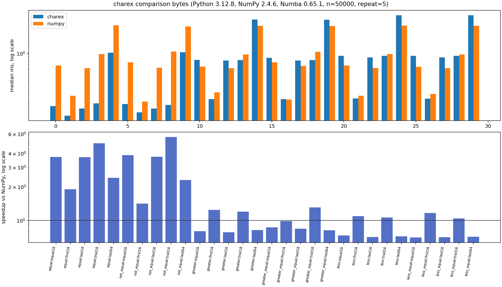
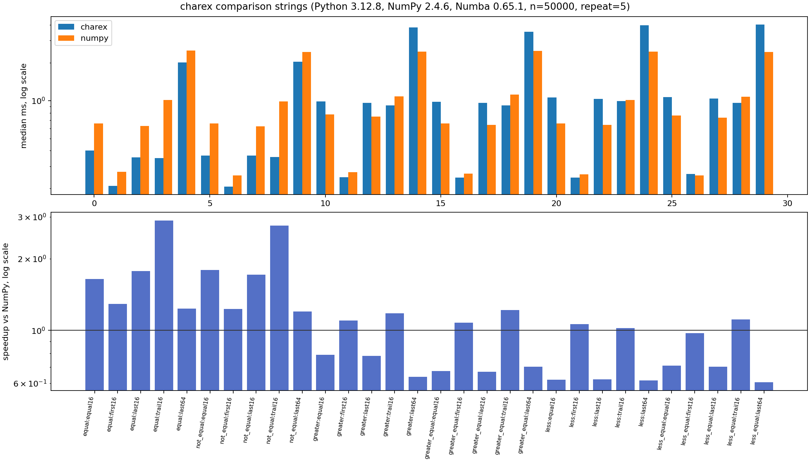
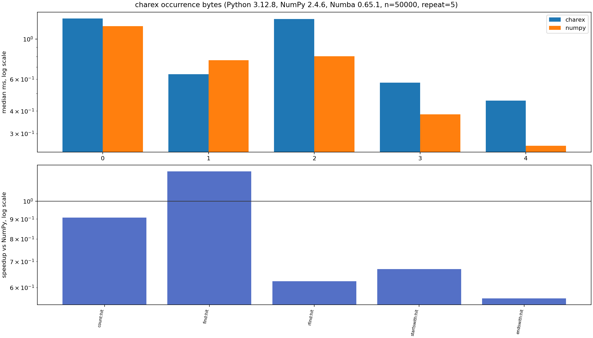
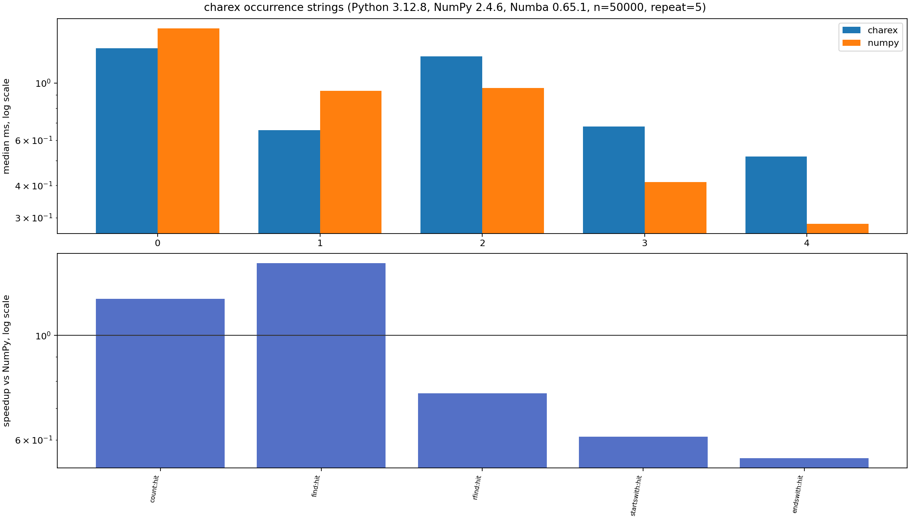
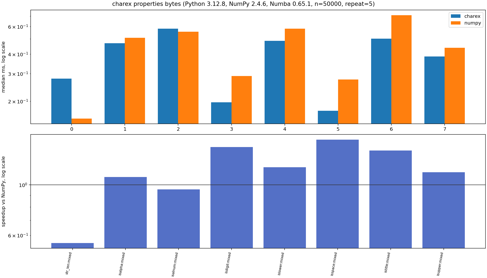
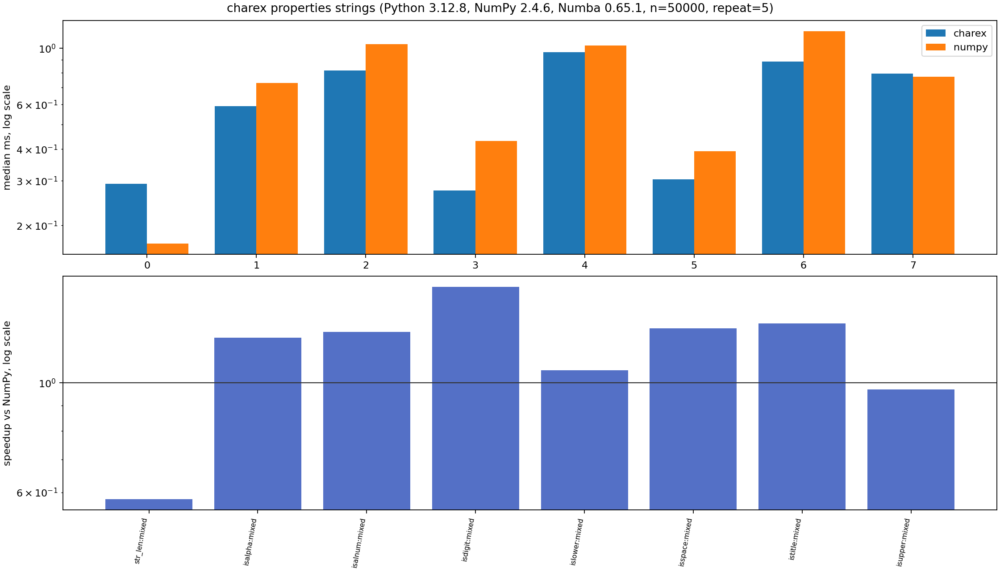
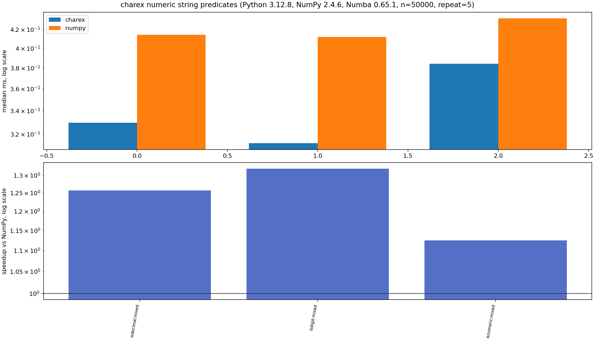

# charex

String array extensions for Numba.

Importing `charex` registers Numba overloads for NumPy's legacy
fixed-width `np.char` string API:

```python
import charex
```

## Compatibility

`charex` targets Numba 0.65.1 and the NumPy ranges tested by that Numba
release:

- Python `>=3.10,<3.15`
- Numba `>=0.65.1,<0.66`
- NumPy `>=1.22,<1.27` or `>=2.0,<2.5`
- llvmlite `0.47.x`

The implemented API is `np.char`, not `np.strings`. NumPy 2.x still supports
`np.char`, but documents it as legacy fixed-width string functionality.
`np.strings` support should be added as a separate API layer because its
semantics are not a drop-in alias for `np.char`.

## Supported Operations

Comparison:

- `char.equal`
- `char.not_equal`
- `char.greater_equal`
- `char.less_equal`
- `char.greater`
- `char.less`
- `char.compare_chararrays`

Occurrence and property information:

- `char.count`
- `char.endswith`
- `char.startswith`
- `char.find`
- `char.rfind`
- `char.index`
- `char.rindex`
- `char.str_len`
- `char.isalpha`
- `char.isalnum`
- `char.isspace`
- `char.isdecimal`
- `char.isdigit`
- `char.isnumeric`
- `char.istitle`
- `char.isupper`
- `char.islower`

Inputs may be scalars or one-dimensional C-contiguous arrays of fixed-width
Unicode strings or bytes. Unicode property predicates follow NumPy/Python
Unicode behavior for `U` strings; bytes predicates follow ASCII byte semantics.

## Performance Matrix

Current Numba 0.65.1 benchmark artifacts are in
[docs/benchmarks/numba-v-0.65.1](docs/benchmarks/numba-v-0.65.1/).

Regenerate the matrix from the repository root:

```bash
python -m pip install -e ".[bench]"
python charex/benchmarks/matrix.py --size 50000 --repeat 5
```

### Comparison Operators




### Occurrence Information




### Property Information





The previous Numba 0.59 matrix is archived under
[charex/benchmarks/numba-v-0.59](charex/benchmarks/numba-v-0.59/).

## Development

Install test dependencies:

```bash
python -m pip install -e ".[test]"
```

Run tests:

```bash
pytest -q
```

Run the benchmark smoke test:

```bash
python charex/benchmarks/benchmark.py --size 50000 --repeat 5
```

Install benchmark plotting dependencies and write CSV/PNG output:

```bash
python -m pip install -e ".[bench]"
python charex/benchmarks/benchmark.py --size 50000 --repeat 5 --plot
```

Last locally tested 2026-05-24 on Python 3.12.8 with:

- Numba 0.65.1, llvmlite 0.47.0, NumPy 1.26.4
- Numba 0.65.1, llvmlite 0.47.0, NumPy 2.4.6
